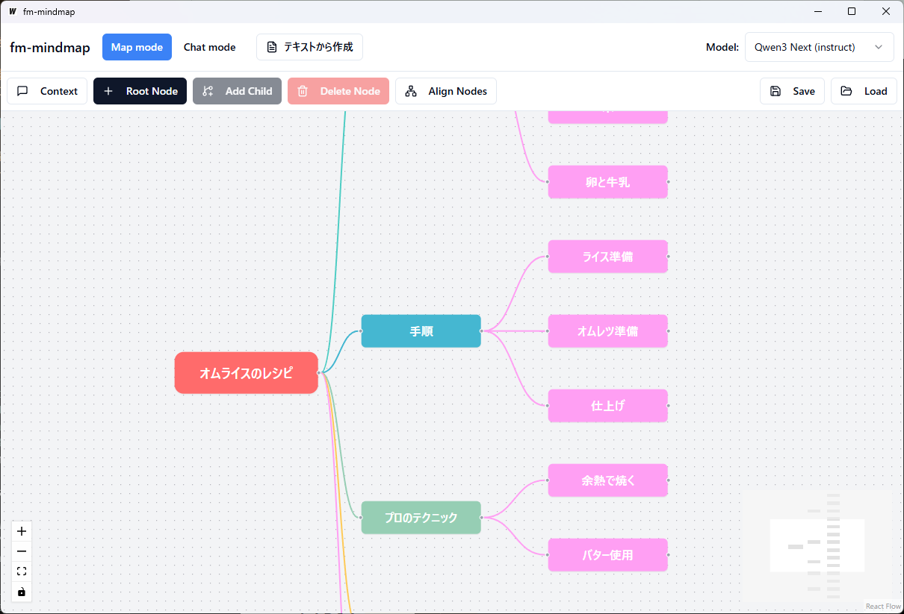

# fm_mindmap_app



**fm_mindmap_app** は、AI搭載マインドマップツール [fm-mindmap](https://github.com/rerofumi/fm-mindmap) を [Wails](https://wails.io/) を使用してデスクトップアプリケーション化したプロジェクトです。

ブラウザベースの `fm-mindmap` をネイティブアプリとしてパッケージングすることで、より快適な操作性と独立した実行環境を提供します。


## 🧩 fm-mindmap とは

AIとの対話を通じてアイデアを広げ、思考を整理するためのインテリジェント・マインドマッピングツールです。

- **チャットモード**: AIと相談しながら課題を抽出し、そこからマインドマップを生成できます。
- **マップモード**: 従来のマインドマップ操作に加え、ノードごとのAI壁打ち、連想ワードの自動展開、タイトルの自動要約などが可能です。
- **マルチモデル対応**: OpenRouter API を通じて、GPT-5, Claude 3.5 Sonnet, Gemini 1.5 Pro など最新のモデルを利用可能です。

詳細は [fm-mindmap の README](https://github.com/rerofumi/fm-mindmap) を参照してください。

## 🛠️ 環境構築

このプロジェクトでは、ビルド環境の構築およびタスクランナーとして [mise-en-place (mise)](https://mise.jdx.dev/) を使用します。
Go, Node.js, Wails などのツールチェーンは `mise` によって管理されるため、個別にインストールする必要はありません。

### 1. mise のインストール

まだ `mise` をインストールしていない場合は、以下の手順でインストールしてください。

**Windows (winget):**
```powershell
winget install jdx.mise
```

その他のOSについては [mise の公式ドキュメント](https://mise.jdx.dev/getting-started.html) を参照してください。

### 2. リポジトリのクローン

このリポジトリは `frontend` ディレクトリをサブモジュールとして持っています。`--recursive` オプションを付けてクローンするか、クローン後にサブモジュールを初期化してください。

```bash
git clone --recursive https://github.com/rerofumi/fm_mindmap_app.git
cd fm_mindmap_app
```

すでにクローン済みの場合は、以下を実行してサブモジュールを更新します。

```bash
git submodule update --init --recursive
```

### 3. ツールのセットアップ

プロジェクトルートで以下のコマンドを実行し、必要なツール (Go, Node.js) をインストールします。

```bash
mise install
```

続いて、Wails の CLI ツールを準備するためのセットアップコマンドを実行します。

```bash
mise run setup
```

## ⚙️ 設定 (.env)

アプリで AI 機能 (OpenRouter) を利用するには、API キーの設定が必要です。
プロジェクトルートに `.env` ファイルを作成し、以下の内容を記述してください。

```env
VITE_OPENROUTER_API_KEY="sk-or-v1-..."
# 必要に応じてデフォルトモデルを指定 (任意)
# VITE_OPENROUTER_MODEL="openai/gpt-4o-mini"
```

*   **開発時 (`mise run dev`)**: プロジェクトルートの `.env` が読み込まれます。
*   **ビルド後**: 生成された実行ファイル (`.exe`) と同じディレクトリに `.env` ファイルを配置してください。

## 🚀 開発とビルド

`mise` コマンドを使用して開発サーバーの起動やビルドを行います。

| コマンド | 説明 |
| :--- | :--- |
| `mise run dev` | 開発モードで起動します。フロントエンドとバックエンドのホットリロードが有効になります。 |
| `mise run build` | プロダクションビルドを実行します。`build/bin` ディレクトリに実行ファイルが生成されます。 |

ビルドされたアプリケーションは `build/bin/fm-mindmap.exe` (Windowsの場合) として出力されます。

## 📂 ディレクトリ構成

- `frontend/`: `fm-mindmap` のソースコード (Git Submodule)。
- `build/`: ビルド成果物やアセットが含まれます。
- `app.go`, `main.go`: Wails アプリケーションのバックエンドロジック。
- `wails.json`: Wails のプロジェクト設定。
- `mise.toml`: 開発ツールのバージョン定義とタスク定義。

## 📄 ライセンス

[MIT License](./frontend/LICENSE)

Copyright (c) 2025 rerofumi
